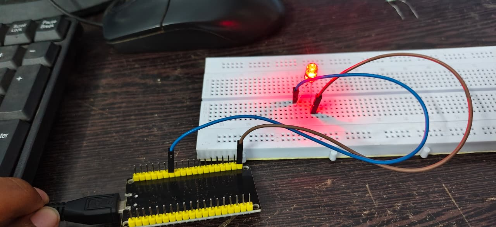
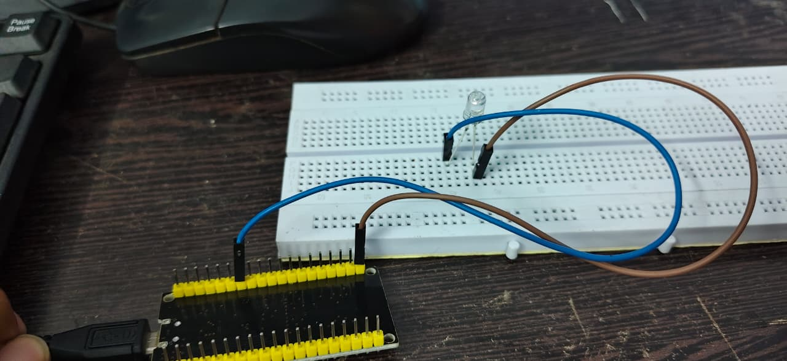

# ESP32 LED Blink

A basic ESP32 project that demonstrates LED control using GPIO 4. The LED is programmed to turn ON and OFF at 1-second intervals, while the Serial Monitor displays the current LED status.

## 📌 Project Overview

This project demonstrates the basic use of ESP32 GPIO programming and digital output control.

The ESP32 continuously performs the following operations:

- Turns the LED ON
- Displays `LED ON` in the Serial Monitor
- Waits for 1 second
- Turns the LED OFF
- Displays `LED OFF` in the Serial Monitor
- Waits for 1 second
- Repeats the process

## 🛠️ Components Required

- ESP32 Development Board
- LED
- Breadboard
- Jumper Wires
- USB Cable

## 🔌 Circuit Connection

| ESP32 Pin | Connection |
|-----------|------------|
| GPIO 4 | LED Anode (+) |
| GND | LED Cathode (-) |

## 📷 Project Demonstration

### LED ON

### LED OFF

## ⚙️ How It Works

### 1. Define the LED Pin

    #define LED_PIN 4

GPIO 4 is assigned to the LED.

### 2. Configure the GPIO Pin

    pinMode(LED_PIN, OUTPUT);

GPIO 4 is configured as an output pin so that the ESP32 can control the LED.

### 3. Turn the LED ON

    digitalWrite(LED_PIN, HIGH);

The ESP32 sends a HIGH signal to GPIO 4, which turns the LED ON.

### 4. Display the LED Status

    Serial.println("LED ON");

The message `LED ON` is displayed in the Serial Monitor.

### 5. Wait for 1 Second

    delay(1000);

The program pauses for 1000 milliseconds (1 second).

### 6. Turn the LED OFF

    digitalWrite(LED_PIN, LOW);

The ESP32 sends a LOW signal to GPIO 4, turning the LED OFF.

The same process repeats continuously inside the `loop()` function.

## 🖥️ Serial Monitor Output

Set the Serial Monitor baud rate to **115200**.

Expected output:

    LED ON
    LED OFF
    LED ON
    LED OFF
    LED ON
    LED OFF

## 🎥 Project Demonstration

The working demonstration shows the LED turning ON and OFF continuously while the corresponding status is displayed in the Serial Monitor.

### Working Video

[▶️ Watch the ESP32 LED Blink Demonstration](https://drive.google.com/file/d/1UX838uovXsEZ1PKmKdCgdra3g4R9f8m1/view?usp=drivesdk)

## 📚 Concepts Learned

- ESP32 GPIO
- Digital Output
- `pinMode()`
- `digitalWrite()`
- `delay()`
- Serial Communication
- Serial Monitor
- Basic Arduino Programming

## 🚀 Future Improvements

- Add a push button to control the LED
- Control multiple LEDs
- Control LED brightness using PWM
- Control the LED through Wi-Fi
- Create a web-based LED control system
